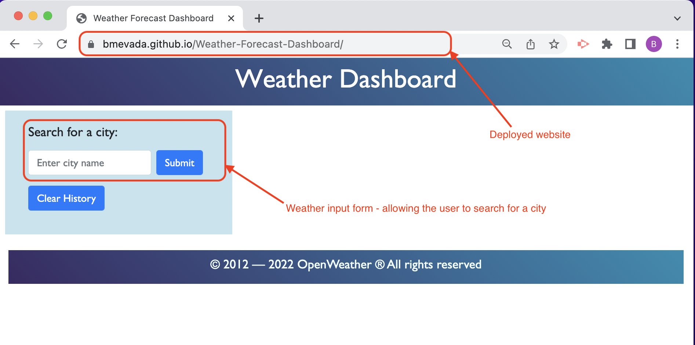
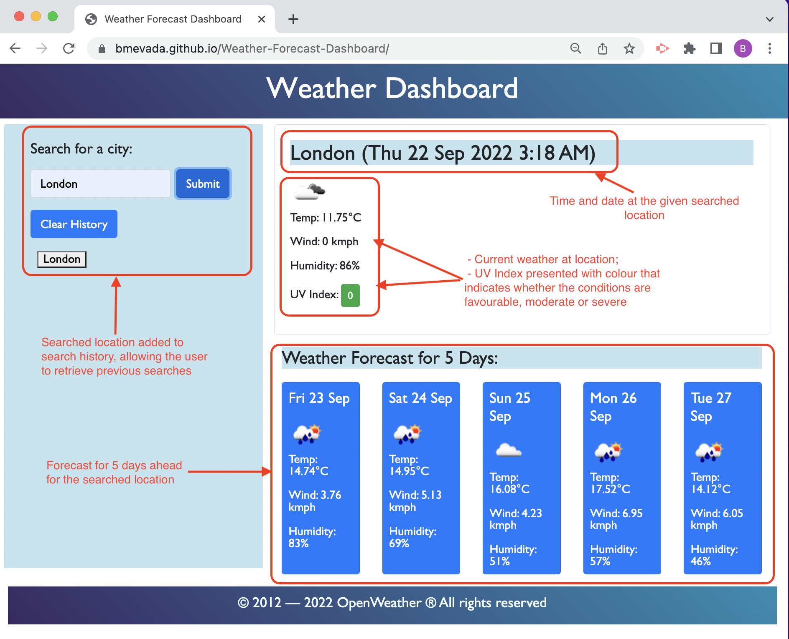
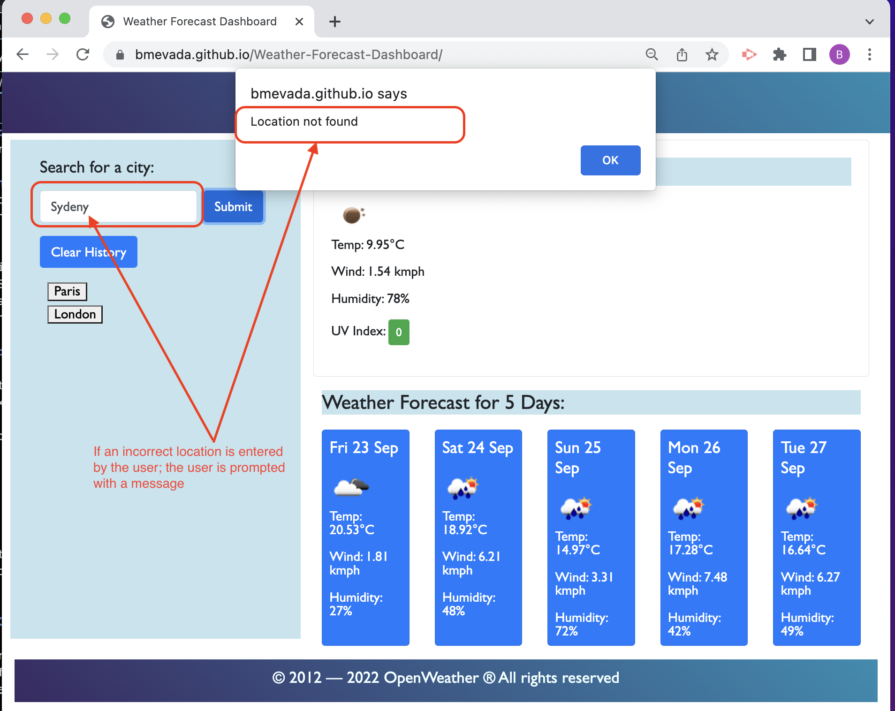
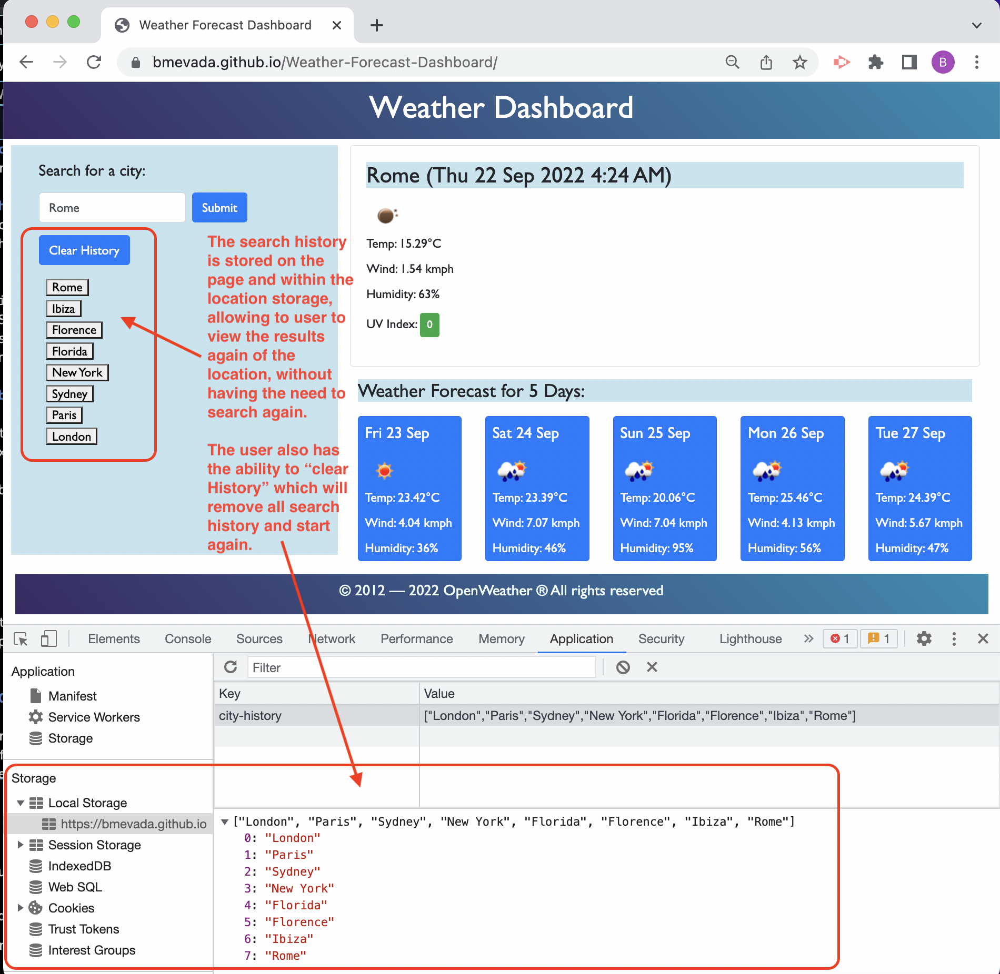

# Weather-Forecast-Dashboard
Week 6: Weather Dashboard - Using Server-Side APIs

## Weather Dashboard
A weather forecast dashboard application has been created to allow the user to view the current weather conditions of the given city and also the future 

This app runs in the browser and feature dynamically updated HTML, JavaScript, CSS powered by jQuery, Bootstrap and Moment JS. It is a clean and polished, responsive user interface that adapts to multiple screen sizes and responds to user interface.

## Deployed Website

[Link to website] https://bmevada.github.io/Weather-Forecast-Dashboard/ 
(Links to an external deployed site)

[Link to Github] https://github.com/bmevada/Weather-Forecast-Dashboard.git

## User Story

AS A traveller
I WANT to see the weather outlook for multiple cities 
SO THAT I can plan a trip ahead accordingly

## Acceptance Criteria

GIVEN a weather dashboard with form inputs

WHEN the user searches for a city

THEN the user is presented with current and future conditions for that city and that city is added to the search history

WHEN the user views current weather conditions for that city

THEN the user is presented with the city name, the date, the time of day, an icon representation of weather conditions, the temperature, the humidity, the wind speed, and the UV index

WHEN the user views the UV index

THEN the user is presented with a color that indicates whether the conditions are favorable, moderate, or severe

WHEN the user views future weather conditions for that city

THEN the user is presented with a 5-day forecast that displays the date, an icon representation of weather conditions, the temperature, the wind speed, and the humidity

WHEN the user searches for an incorrect city

THEN the user will be prompted with "Location not found"

WHEN the user clicks on a city in the search history

THEN the user again is presented with current and future conditions for that city

